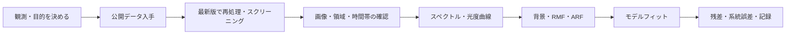

# 解析の全体像

Chandra の ACIS では CIAO の `chandra_repro` が校正を反映したイベント生成の入口です。XRISM では配布済みの cleaned event と観測ログから始め、公式 ABC Guide の追加スクリーニングを科学目的ごとに判断します。どちらもスペクトルを出しただけではフィットはできません。対応する背景・RMF・ARF の確認が必要です。

まず次を記録します。

| 項目 | 例 |
| --- | --- |
| 観測 | ObsID、機器、観測モード、公開日 |
| 目的 | 画像、点源/拡散源、時間・スペクトル |
| ソフト | CIAO/HEASoft/XSPEC の版 |
| 校正 | Chandra または XRISM CALDB の版・更新日 |
| 選択 | 事象の grade、時間帯、領域、背景 |

全ミッション共通の「ワンボタン」コマンドはありません。各ミッションの公式スレッドを、その解析条件に合わせて選びます。

